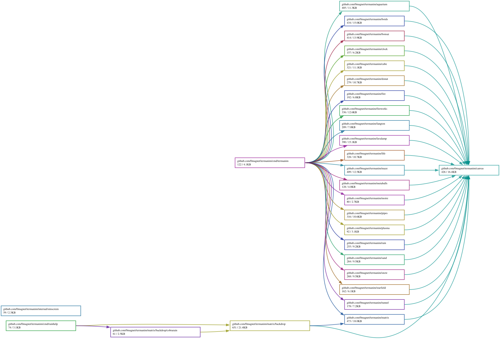

# termanim

Twenty-one terminal animations in Go, on
[tcell](https://github.com/gdamore/tcell). They run in a terminal, and —
because they never create or destroy the screen they are given — equally in a
browser through [tuiwasm](https://github.com/0magnet/tuiwasm) or inside any
program that already owns a `tcell.Screen`.

**Live demo** — every animation here runs in a browser tab as part of
[tuiwasm](https://0magnet.github.io/tuiwasm/), which registers them from this
package. Each has a page of its own:
[matrix](https://0magnet.github.io/tuiwasm/?demo=matrix) ·
[donut](https://0magnet.github.io/tuiwasm/?demo=donut) ·
[fireworks](https://0magnet.github.io/tuiwasm/?demo=fireworks) ·
[aquarium](https://0magnet.github.io/tuiwasm/?demo=aquarium) ·
[boids](https://0magnet.github.io/tuiwasm/?demo=boids) ·
[plasma](https://0magnet.github.io/tuiwasm/?demo=plasma) ·
[starfield](https://0magnet.github.io/tuiwasm/?demo=starfield) ·
[life](https://0magnet.github.io/tuiwasm/?demo=life) — and the rest from the
launcher there.

```sh
go install github.com/0magnet/termanim/cmd/termanim@latest

termanim --list
termanim donut
```

Press `q`, `Escape` or `Ctrl-C` to stop.

## What is here

Fields and simulations, drawn on the pixel surface:

| package | effect |
|---|---|
| `fire` | a heat grid seeded with noise and cooled upward |
| `plasma` | summed sine waves of position, offset by time |
| `metaballs` | blobs that bulge and merge as they approach |
| `moire` | two drifting ripples interfering |
| `lavalamp` | wax that heats, rises, cools and sinks in a vessel |
| `tunnel` | flying down a textured tube |
| `starfield` | stars streaming past the viewer |
| `donut` | a lit torus with a z-buffer |
| `cube` | a rotating wireframe solid, shaded by depth |
| `boids` | flocking by separation, alignment and cohesion |
| `rain` | drops with depth, slant, streaks and splashes |
| `snow` | flakes that sway, settle and drift into banks |
| `fireworks` | shells that rise, burst and droop into willows |
| `life` | Conway's life, colored by how long a cell has lived |
| `langton` | Langton's ants: chaos, then the highway |
| `sand` | grains heaping at their angle of repose |
| `maze` | a maze carved by backtracking, then solved |

Made of characters, painting glyphs directly:

| package | effect |
|---|---|
| `matrix` | falling columns of glyphs |
| `aquarium` | fish swimming past swaying seaweed |
| `pipes` | pipes growing and turning, with correct elbows |
| `bonsai` | a bonsai tree growing branch by branch |

`canvas` holds the surface, the palettes and the frame loop they share.

## Behind other text

`matrix/backdrop` composes text over the rain instead of replacing the screen
with it. The text keeps a cell of clear either side of every word, so it stays
readable, and the rain fills what the layout left empty. Two shapes use it, and
both are in service.

**A still frame behind a help screen.** `matrix/backdrop/cobrarain` wraps a
cobra command's help function, buffers what it would have printed, and renders
the rain behind it:

```go
cobrarain.On(rootCmd, backdrop.Options{})
```

That is the whole integration. Help for every command under the root goes
through it, because cobra looks up the help function on the parent when a
command has none of its own. `cmd/rainhelp` is a worked example — a CLI with
nothing in it but that one call.

It is a *still*: nothing takes over the terminal, nothing waits for a key, and
the help scrolls up the scrollback the way help does. Seed it and the same
frame comes back every time:

```
go run ./cmd/rainhelp --seed 1 --help     # the same frame every time
go run ./cmd/rainhelp --help | cat        # plain, as a pipe should be
```

Redirecting or piping turns it off, so `--help | less` and a `--help` pasted
into a bug report are both plain text. Wire it *after* anything else that
styles the help — `coloredcobra`, say — since it captures whichever help
function is installed when it is called.

**An animated background behind a TUI.** `backdrop.New` returns a `Painter`
that keeps the rain's state between frames, so a full-screen program can
redraw its own text over a rain that keeps falling:

```go
p := backdrop.New(backdrop.Options{Pad: -1, GapMin: 4, Force: true})
for {
    io.WriteString(out, p.Frame(render(), dt)) // or p.Tick(render())
}
```

`Frame` advances by elapsed time and `Tick` by one step, which is the same
distinction the animations themselves draw — see **Frame rate** below. The
options above are skywire's, which drives this under `skywire --tui`: `Pad: -1`
and `GapMin: 4` because that program composes its own screen and tells the
backdrop where the empty space is, and `Force: true` because it is undimmed —
the clear cell either side of each word is what keeps the text legible, and
`GapMin` already confines the rain to the gaps.

**Any of the pixel animations, not just the rain.** `RenderAnim` is `Render`
with something else behind the text, and `NewFor` is `New` the same way:

```go
fmt.Print(backdrop.RenderAnim(help, starfield.New(0), backdrop.Options{}))

p := backdrop.NewFor(plasma.New(), backdrop.Options{Pad: -1, GapMin: 4})
```

Anything implementing `canvas.Animation` works, which is sixteen of the effects
here and anything you write. What made this possible was giving the compositor
a cell type of its own: it used to read `matrix.Cell`, which carries an
`Intensity` into a green ramp and a `Hot` flag for the highlighted leading
glyph — the rain's own vocabulary, asking questions a plasma cannot answer.
`backdrop.Cell` is a glyph and the colors to draw it in, `backdrop.Frame` is a
grid of those, and the two adapters that fill one — `Frame.FromMatrix` and
`Frame.FromSurface` — are where each animation's own model is resolved. Fill a
`Frame` yourself and `RenderFrame` will composite over it.

`FromSurface` is the half-block trick working under text rather than on a
screen of its own: two pixel rows to the cell row, and a cell with one pixel
lit drawn as whichever block leaves the other half to the terminal.

Sparse effects suit this best — `snow`, `rain`, `starfield`, `life`,
`fireworks`, `boids` leave most cells clear, which is what makes a backdrop
read as something *behind*. The dense fields, `plasma` and `metaballs` and
`fire`, cover every cell and put the text on a solid field; `Dim` and `GapMin`
are the knobs for that. `Warm` is the pixel animations' equivalent of `Steps`,
since they open on an empty screen and take a second to fill.

The four `CellAnimation` effects — `aquarium`, `pipes`, `clock`, `bonsai` —
paint a `tcell.Screen` rather than a surface and are still out of reach. They
would need a screen-to-cell adapter, which is a different piece of work.

## Two pixels per cell

A terminal cell is about twice as tall as it is wide, so an animation drawn one
pixel per cell looks squat and coarse. `canvas.Surface` draws every cell as an
upper half block — `▀`, foreground coloring the top half, background the
bottom — which gives two independently colored pixels per cell, roughly
square, at no cost. An animation sees a surface twice the height of the
terminal and never thinks about it.

Not everything wants that. `matrix`, `aquarium`, `pipes` and `bonsai` are made
of characters, and squeezing them onto a pixel surface would throw away the
thing they are made of, so they implement `canvas.CellAnimation` and paint
glyphs. Both shapes share the same loop, keys and resize handling.

## Writing another one

Implement two methods and hand it to `canvas.Run`:

```go
type Animation interface {
	Resize(w, h int)                    // allocate here, not per frame
	Frame(s *canvas.Surface, dt float64) // dt is seconds since the last frame
}
```

`Resize` is called once before the first frame and again on every size change,
so buffers are allocated there and the frame path stays allocation-free — which
matters at sixty frames a second in a browser. Most packages here have a test
asserting `Frame` allocates nothing.

Scale every motion by `dt` and express its constant per second. `canvas` clamps
`dt` to 0.1 s, so a stalled process resumes rather than teleporting everything
across the screen in one step.

## Frame rate

The default is 60, and it fits: measured on a 200x50 terminal these effects
compute a frame in 0.05 to 4.3 ms, while handing a full screen to tcell costs
about 6.8 ms whatever is being drawn. The output path dominates and is the same
for all of them, so even the heaviest sits inside a 16.7 ms budget.

Every animation advances by **elapsed time**, not by frame. `Frame` is given
the seconds since the last one, and every rate is expressed per second. That
buys two things:

- The target rate can change without changing how fast anything appears to
  move.
- A browser tab that misses ticks drops frames instead of running in slow
  motion, which is what happens when motion is counted per frame.

Most packages have a test asserting it: the same wall-clock interval, divided
into frames two different ways, must reach the same state. Several are
pixel-identical between 30 and 60 fps.

Where the rule is a discrete step — a Life generation, an ant's move, a grain
falling one cell — the animation keeps a time accumulator and runs whole steps
from it, rather than a fractional one. Those are documented as a rate per
second on the type.

Converting this exposed two bugs that had nothing to do with frame rate as
such. A drag written as `v *= 0.9` per frame is not a property of the fluid at
all but of how often it is drawn, and had to become `exp(-rate·dt)`. And a
projectile under gravity does not follow the same arc when stepped at a
different size unless it is integrated with the midpoint form.

## Provenance

Every effect here is written from a description of the technique, not from
anyone's source.

The methods are old and widely documented: a heat grid cooled toward the
average of the cells beneath it; a sum of sine waves of the pixel coordinates
offset by time; an inverse-square field per blob; a torus parametrised by two
angles and depth-tested; Reynolds' three flocking rules; B3/S23; a recursive
backtracker. Matrix rain, an aquarium, pipes and a bonsai are each fully
described by what they look like.

Programs that draw the same things — libcaca's `cacafire` and `cacademo`,
aalib's `aafire`, `TMatrix`, `neo`, `cmatrix`, `asciiquarium`, `cbonsai`,
`pipes.sh` — were used as a reference for *what the result should look like*,
and most of those are GPL. None of their code was read into this, and none of
their artwork is used: the fish here are drawn from scratch and are
deliberately simpler than `asciiquarium`'s. That is why this repository can be
MIT.

## License

MIT — see [LICENSE](LICENSE).

## Dependency Graph

Made with [goda](https://github.com/loov/goda):

```
# GOOS=js: the import edges of a wasm program live in js/wasm-tagged
# files and are invisible to a host-context run
GOOS=js GOARCH=wasm go run github.com/loov/goda@latest graph github.com/0magnet/termanim/... | dot -Tsvg -o docs/termanim-goda-graph.svg
```



## Lines of Code

Made with [gocloc](https://github.com/hhatto/gocloc) (excludes `vendor/`, `node_modules/`, `.git/`):

```
gocloc --not-match-d='(vendor|node_modules|\.git)' .
```

```
-------------------------------------------------------------------------------
Language                     files          blank        comment           code
-------------------------------------------------------------------------------
Go                              66           1264           3347          10609
Markdown                         1             31              0            109
YAML                             1              0              7             98
-------------------------------------------------------------------------------
TOTAL                           68           1295           3354          10816
-------------------------------------------------------------------------------
```
